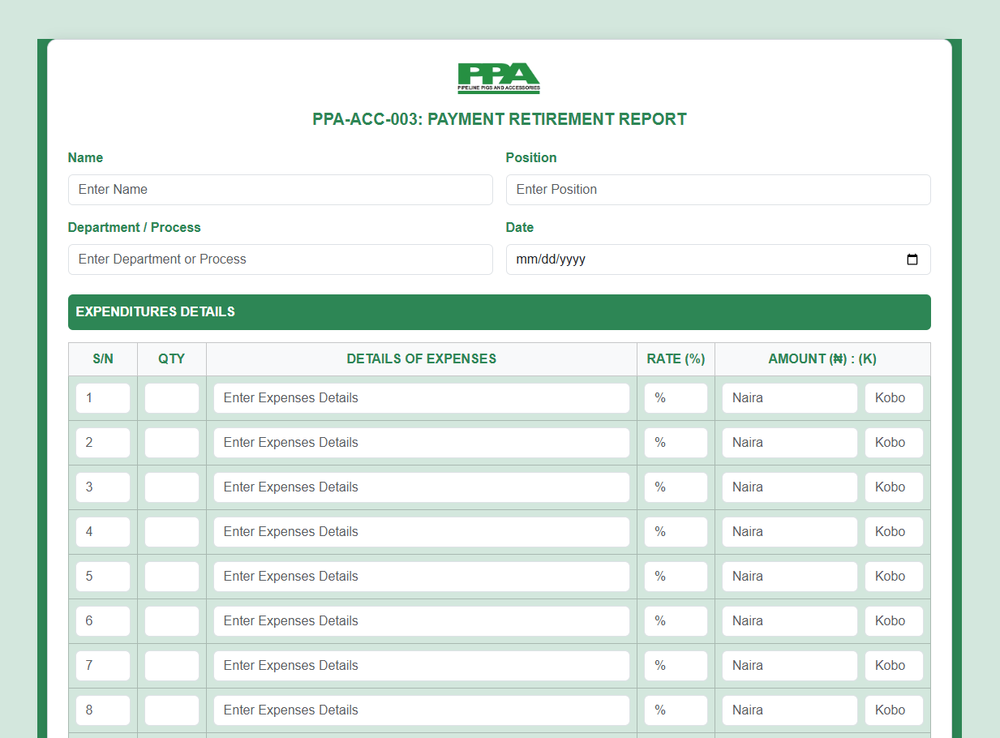
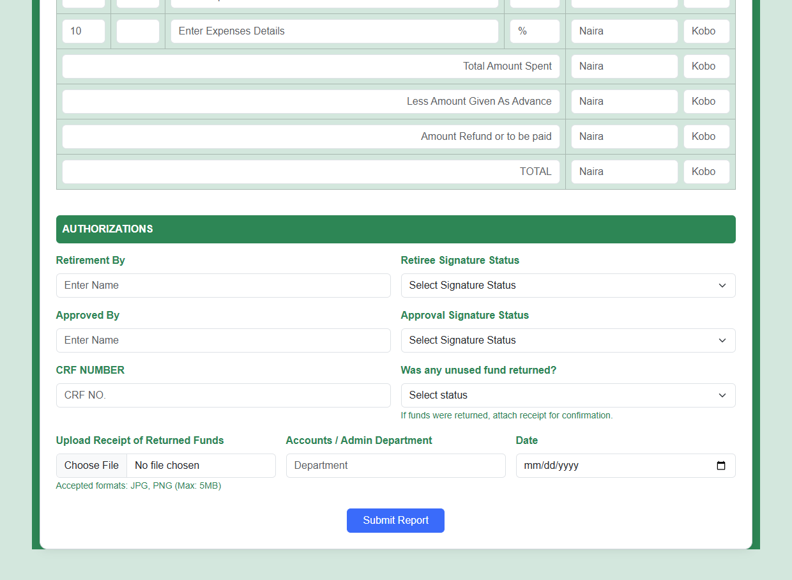

# Pipeline Pigs and Accessories Limited

**Payment Retirement Report 🧾**

This repository contains a **responsive, policy-compliant Payment Retirement Form** custom-built for **Pipeline Pigs and Accessories Limited**, a Pipeline Flow Assurance Company. It streamlines payment retirement and reconciliation while ensuring transparency, traceability, and compliance with internal audit requirements.

---

## 📋 Form Overview

### ✨ Key Features

- **Policy-Based Reporting Format**  
  Enforces structure for expenses, account code tracking, refund reconciliation, and departmental approvals.

- **Clean UI with Company Branding**  
  Uses a styled green-themed Bootstrap layout that reflects Pipeline Pigs and Accessories Limited’s brand color.

- **Dynamic Expense Breakdown**  
  Allows user to input multiple expense rows with quantity, description, and amount in Naira and Kobo.

- **Approval Workflow Integration**  
  Includes retirement by, signature status, and approving officers with selection dropdowns.

- **Evidence Upload**  
  Attach proof of expenditure and receipt for any returned funds.

- **Fully Responsive**  
  Optimized for mobile and desktop views using Bootstrap 5.3.

---

## 🖼️ Screenshots

### ✅ Form Header & Branding


### ✅ Dynamic Expense Table


### ✅ Signature and Authorization Section


---

## 🛠️ Technologies Used

- **HTML5** – Semantic structure
- **Bootstrap 5.3** – Responsive grid and components
- **CSS3** – Custom stylings

---

## 🔍 How It Works

1. **Enter Basic Info** – Name, department, and position.
2. **List Expenses** – Input quantity, details, rate, and amount (split into Naira & Kobo).
3. **Total Summary** – Calculate totals, advance deductions, and final reconciliation.
4. **Authorizations** – Complete with signature statuses and name of approvers.
5. **Upload Receipts** – Attach supporting documents.
6. **Submit** – Process or print the completed form.

---

## 📦 File Structure

```bash
├── index.html             # Main form file
├── style.css              # Custom styling (if needed)
├── img/
│   ├── logo.png           # Company logo
│   ├── shot1.png          # Screenshot preview
│   └── shot2.png          # Additional preview
```

---

## 🔖 Tags

#ExpenseReport #Finance #Bootstrap5 #ResponsiveForms #PipelineCompany #HTML5 #PPAForms

---

**Crafted for financial clarity, accountability, and audit-readiness at Pipeline Pigs and Accessories Limited.** 💼✅
